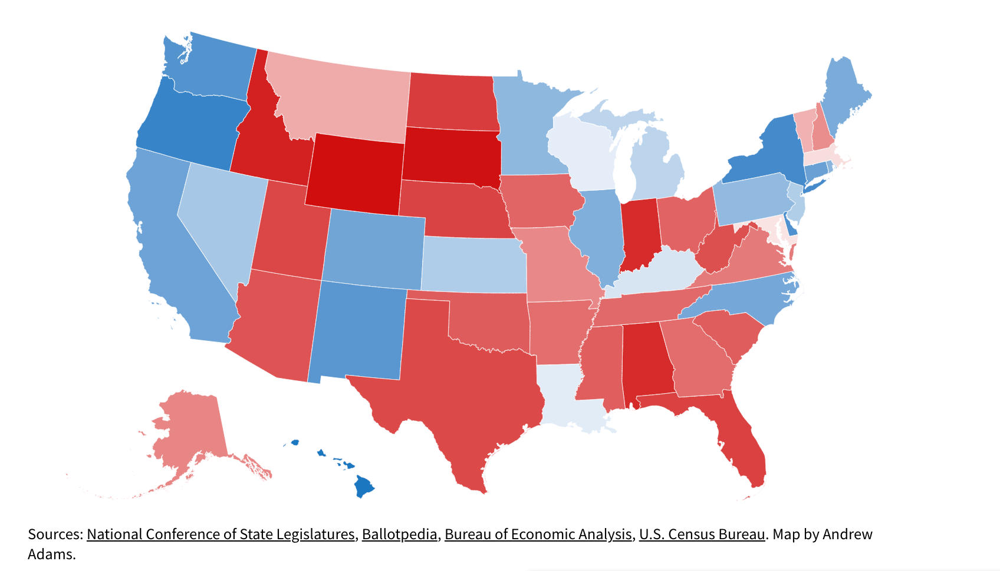

# Exploring Factors Affecting Life Expectancies By State and Gender *Dataset Project*

---
## **Introduction**
---
### What is your general motivation for this topic? Provide some context that explains why the topic is interesting or important to you.
This topic interests me because since I was 6 I have been volunteering for a shelter in Stamford called Inspirica which is a place where homeless and housing-insecure youth and families can live and go to rehab, become more financially literate, and eventually be placed in permanent housing. I've always been curious about how income can affect the quality and length of a person's life and how that varies around the US. We are fortunate to live in an area that focuses on the needs of others (like this shelter) probably partially due to the fact that we can financially contribute. When I was volunteering I would mainly attend Arts and Crafts and Reading nights with the children living in the shelter but when COVID hit, these programs were shut down and I knew Inspirica could use all the help it could get. Because of this, I founded a 501c3 organization called Heart to Art which raised over $150,000 last year for Inspirica and I hope to continue to combat this problem. I am really interested in this dataset because if life expectancy is affected by income level, how do we create a more equitable way of living/ how do we give those with lower income levels equal/similar access to the healthcare help they may need to live long, healthy lives? I'm also curious to see if there are regional differences or political differences by state and if that affects life expectancy- this is especially relevant because during COVID-19, data was collected that showed that there tended to be a significantly higher vaccination rate in democratic states over republican states and this data was published through many articles online like this one: [For Covid-19 Vaccination Rates, party affiliation matters more than race and ethnicity](https://www.brookings.edu/blog/fixgov/2021/10/01/for-covid-19-vaccinations-party-affiliation-matters-more-than-race-and-ethnicity/). This led me to be curious if this was true for other vaccines and if so, this affected the life expectancy of people in those states.

### What are the 2-3 specific questions you attempted to answer?
1. Do people in lower income quartiles tend to have lower life expectancies in the US?
2. Do the states of a certain political vote status (dem, rep, switch) have a generally higher life expectancy?

---
## **Methods**
---

### *Dataset -->* Describe what you know about how the data was generated. If possible, include information about who owns the dataset and why you are able to use it 

This dataset was created by Raj Chetty, Michael Stepner, Sarah Abraham and their other partners at JAMA Network republished by The Health Inequality Project. I have permission to use the dataset owner's dataset with the request that I cite their 2016 JAMA paper which they linked on The Health Inequality Project's website and has been viewed over 200,000 times and cited over 1,000 times. To get the dataset from its source visit this link [Health Inequality Project](https://healthinequality.org/data/). I used the third data file labeled "Satte life expectancy estimates" and edited it slightly just by deleting the first column of the data because I found it to be unneccessary and distracting from the data itself. 

### *Process -->* How did you go about answering your questions? What specific pieces of information did you need from your data set and how did you combine data to arrive at your answer?

This is the link I used to assign states to either the BlueStates dataset or the RedStates dataset which you can edit because I've linked them above! Feel free to change the party affiliation for states and rerun my program to see how the life expectancies change!
[Which States Fall Under Which Party](https://www.governing.com/now/maps-whats-the-real-red-and-blue-balance-of-state-government)
Here is the map I used:

### *Challenges -->* What difficulties did you run into, and how did you approach solving them?

---
## **Results and conclusion**
---

### What did the data show? What are your takeaways? Plots might be helpful (though not required) depending on your question. Make sure to also discuss the limitations of your research.

### What are some related or additional questions that you would explore if you had more time and resources?

If I had more time and resources I would explore the differences in male and female results and probably also go into more depth by state (i.e. adding a dataset for swing states (ones that often switch between republican and democrat majorities))

If I removed swing states from the data, would the results be more drastic? 
At what point is the difference in life expectancies by party status correlation?

I would also like to know how my data for income quartile changes if I weight the states based on population size (obviously California is going to have more weight than Kansas because it has many more people in the state)

